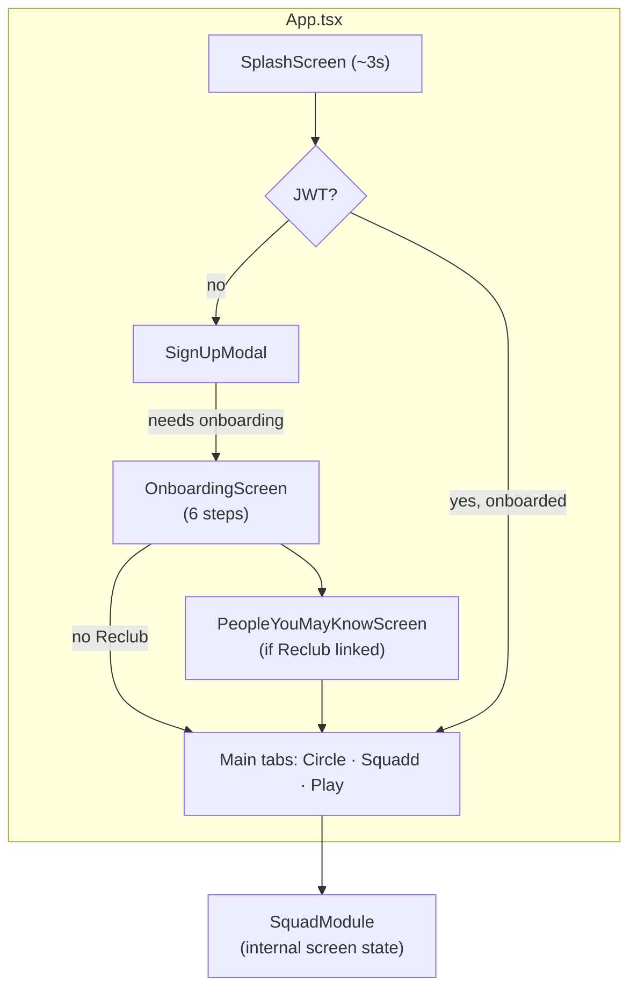
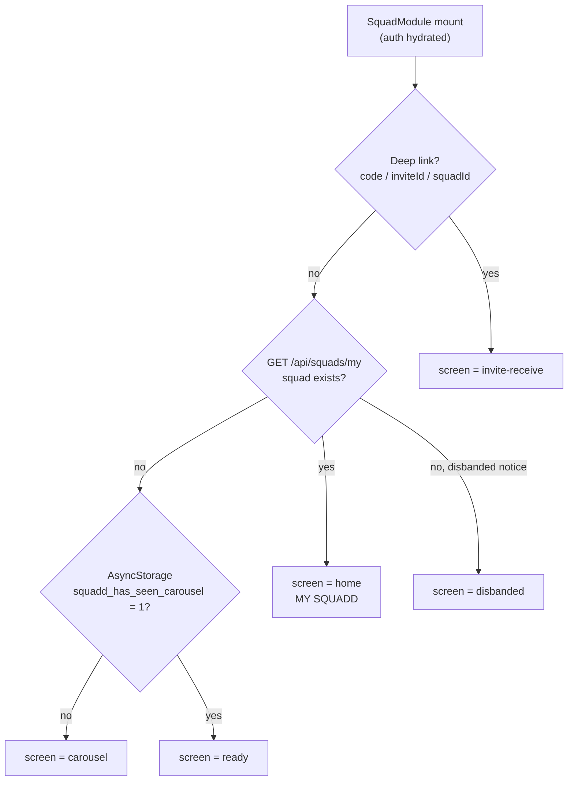
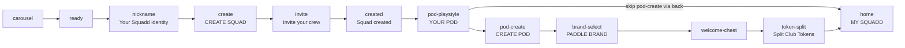
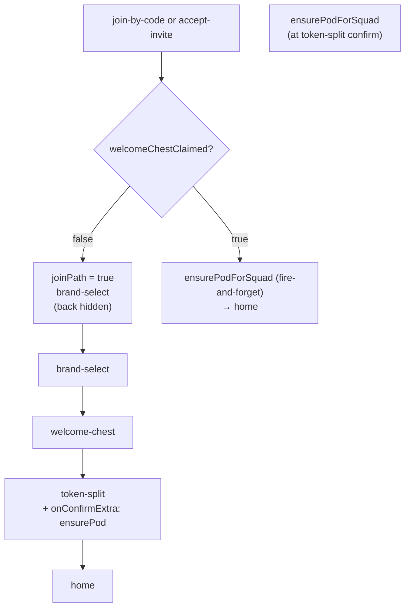
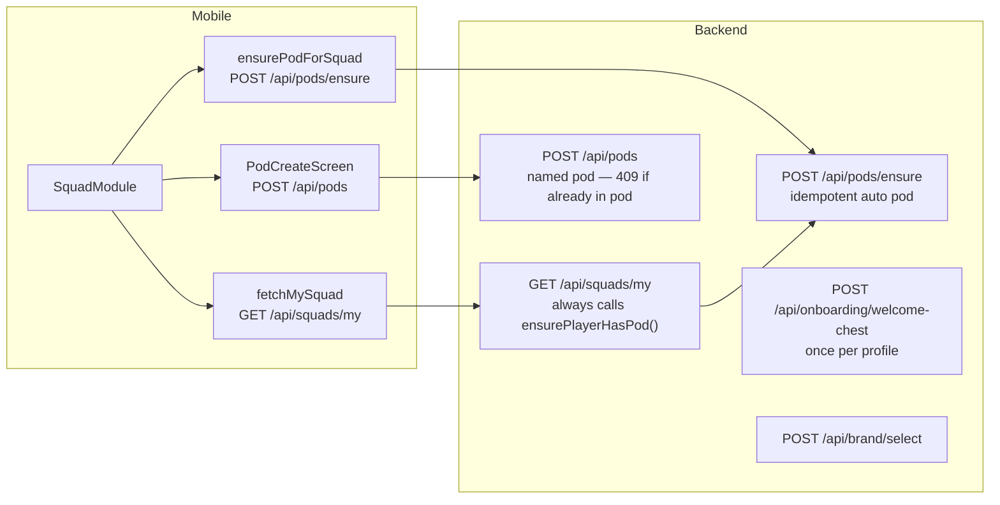
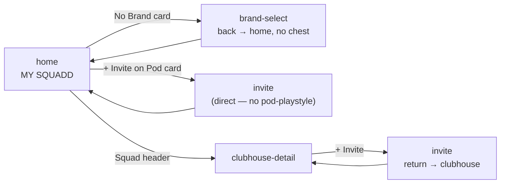

# Onboarding, Squad & Pod Flows — Reference

> **Scope:** App entry → profile onboarding → Squadd tab → squad create/join → pod → brand → welcome chest → **MY SQUADD**  
> **Last reviewed:** 2026-06-20  
> **Source of truth:** `mobile/src/modules/squad/SquadModule.tsx`, `mobile/App.tsx`, `mobile/src/screens/OnboardingScreen.tsx`

---

## 1. Two separate onboarding layers

The app has **two independent flows** that users experience in sequence (but are not wired together automatically):

| Layer | Where | Trigger | Persists via |
|-------|-------|---------|--------------|
| **Profile onboarding** | Full-screen overlay (`App.tsx`) | First sign-in when `hasCompletedOnboarding === false` | `authStore.hasCompletedOnboarding`, `POST /api/profile` |
| **Squad onboarding** | Squadd tab (`SquadModule`) | User opens Squadd tab | Local `screen` state + `AsyncStorage` key `squadd_has_seen_carousel` |

After profile onboarding completes, the user lands on **Play** or **People you may know** — **not** on the Squadd tab. Squad/pod/brand/chest only start when they open Squadd themselves.



---

## 2. Profile onboarding (6 steps)

**File:** `mobile/src/screens/OnboardingScreen.tsx`

| Step | Title | Data collected | API |
|------|-------|----------------|-----|
| 0 | Squad nickname | `@handle` | `GET/POST /api/squads/nickname` |
| 1 | DUPR | Optional rating | Saved in profile prefs |
| 2 | Location | Mock HCMC | Stubbed (`market: 'hcm'`) |
| 3 | Avatar / gender | `man` / `female` | Profile prefs |
| 4 | Link Reclub | Optional player search | `POST /api/profile` with `reclubUserId` |
| 5 | Complete | — | Sets `hasCompletedOnboarding` |

**Note:** Step 0 saves the **same** `squadNickname` used later in `SquadNicknameScreen` during squad creation. Users who complete profile onboarding may see nickname pre-filled again when creating a squad.

---

## 3. SquadModule routing (boot & tab sync)

**File:** `mobile/src/modules/squad/SquadModule.tsx`  
**Orchestrator:** internal `screen: SquadScreen` state (not React Navigation).

### Boot sequence



### Tab re-sync (runs every time Squadd tab becomes active)

When `isActive` flips to `true`, `syncSquaddRoute('tab active')` runs:

1. If user **has a squad** → force `screen = home`
2. Else if carousel not seen → `carousel`
3. Else → `ready` / pending invite / disbanded

**This does not respect mid-flow screens** (pod, brand, chest, invite, etc.).

---

## 4. Squad creation flow (founder)



| Screen ID | UI title | Entry | Exit |
|-----------|----------|-------|------|
| `carousel` | Marketing carousel (5 slides) | First visit / dev reset | CTA → sign-in if needed, then `ready` |
| `ready` | SQUADD | No squad, carousel done | Create → `nickname` |
| `nickname` | Your Squadd identity | Create CTA | Confirmed → `create` |
| `create` | CREATE SQUAD | Nickname done | `POST /api/squads` → `invite` |
| `invite` | Invite your crew | After create / from home | Sent or skip → `created` (or back to home/clubhouse) |
| `created` | Squad created | Invite done | **Go to my squad** → `pod-playstyle` |
| `pod-playstyle` | YOUR POD | Post-create | Select style → `pod-create` |
| `pod-create` | CREATE POD | Playstyle picked | Created/skip → `brand-select` |
| `brand-select` | PADDLE BRAND | Pod step done | Selected/skip → `welcome-chest` (or `home` if entered from home) |
| `welcome-chest` | Welcome Chest | Brand step | Open → `token-split` |
| `token-split` | Split your Club Tokens | Chest opened | Confirm → `home` |
| `home` | MY SQUADD | Flow complete / returning user | — |

---

## 5. Squad join flow (member)

Branching key: **`welcomeChestClaimed`** on the player profile (global, not per-squad).



Joiners **skip** `pod-playstyle` and `pod-create` by design. Pod is auto-created on the backend.

---

## 6. Pod, brand & chest — backend behavior



| Mechanism | When | Effect |
|-----------|------|--------|
| `ensurePlayerHasPod()` in `GET /api/squads/my` | **Every** squad fetch | Silently creates auto-named pod if none exists |
| `POST /api/pods` | User names pod in `PodCreateScreen` | Fails **409** if player already has a pod in that squad |
| `POST /api/pods/ensure` | Join path token-split; pod-create skip | Idempotent auto pod |
| `welcomeChestClaimed` | Profile flag | Join skips brand/chest if already true |
| Dev reset | `POST /api/squads/dev/reset-flow` | Clears chest, brand, wallet, `welcomeChestClaimed` |

---

## 7. Secondary paths (from MY SQUADD)



---

## 8. Key mobile state (`SquadModule`)

| State | Purpose |
|-------|---------|
| `screen` | Current `SquadScreen` — single source of navigation |
| `joinPath` | Joiner in brand/chest flow — hides back on brand-select |
| `joinedSquadId` | Squad ID for `ensurePodForSquad` on token-split |
| `brandSelectBackScreen` | Back target from brand-select (`pod-playstyle` or `home`) |
| `podPlaystyleForInvite` | **Defined but never set `true`** — dead branch |
| `inviteReturnScreen` | Where invite screen returns (`create`, `created`, `home`, `clubhouse-detail`) |
| `createdSquad` | Squad snapshot for invite/created screens |
| `welcomeChestResult` | Chest rewards for token-split |

**AsyncStorage keys**

| Key | Purpose |
|-----|---------|
| `squadd_has_seen_carousel` | Skip carousel on return visits |
| `squadd_pending_invite` | Deferred invite from invite-receive "Maybe later" |
| `squadd_dismissed_disband_{squadId}` | Hide disbanded notice |

---

## 9. Known issues & inconsistencies

Issues observed from code review (no fixes applied in this doc):

### 9.1 Pod naming broken for squad creators

`SquadCreatedScreen` → **Go to my squad** calls `fetchMySquad()` before `pod-playstyle`:

```665:665:pickleball-hub/mobile/src/modules/squad/SquadModule.tsx
          onGoToSquad={() => { void fetchMySquad(); setScreen('pod-playstyle'); }}
```

`GET /api/squads/my` **always** runs `ensurePlayerHasPod()`, creating an auto pod immediately. When the user then tries to name their pod via `POST /api/pods`, the API returns **409 Already in a Pod**.

**Symptom:** CREATE POD fails or shows error after the intended onboarding path.

---

### 9.2 Tab switch resets mid-flow onboarding

Every time the Squadd tab becomes active, `syncSquaddRoute` calls `routeIfHasSquad()` → if squad exists, forces `screen = home`.

**Symptom:** User on `pod-playstyle`, `brand-select`, `welcome-chest`, or `token-split` switches to Circle/Play and back → lands on MY SQUADD, skipping remaining steps.

---

### 9.3 App restart does not resume squad onboarding

Boot routing: has squad → `home`. There is no persisted “onboarding step” for pod/brand/chest.

**Symptom:** Kill app mid brand-select → reopen → MY SQUADD with possibly no brand and unclaimed welcome chest (user must use dev reset or discover No Brand card).

---

### 9.4 `podPlaystyleForInvite` is dead code

Plan doc says: MY SQUADD → + Invite → YOUR POD → Invite your crew.

Actual wiring: `onPodInvite` goes **directly** to `invite`. `setPodPlaystyleForInvite(true)` is never called anywhere.

**Symptom:** YOUR POD screen never appears on the invite-from-home path; playstyle selection skipped.

---

### 9.5 Back from YOUR POD skips remaining onboarding

`pod-playstyle` `onBack` → `home` (not `created` or previous step).

**Symptom:** User can reach MY SQUADD without brand, chest, or token split.

---

### 9.6 Duplicate nickname collection

Profile onboarding step 0 and `SquadNicknameScreen` both collect/save `@squadNickname`. Redundant for users who completed profile onboarding first.

---

### 9.7 Gate screen removed but still in types/docs

`SquadScreen` union includes `'gate'` but no screen is rendered. Old docs reference `SquadGateScreen` and a follows threshold — **not active** in current `SquadModule`.

---

### 9.8 Legacy waitlist carousel unused

`SquaddOnboarding.tsx` (8-screen waitlist/reservation flow) is **not** mounted in `App.tsx`. Production Squadd tab uses `SquadModule` → `SquadCarouselScreen`.

---

### 9.9 `getMySquad()` TypeScript type incomplete

Mobile `api.getMySquad()` return type omits `myPod`, `activeChest`, etc. Runtime data is present; `extractPhase2Data()` handles it opportunistically.

---

## 10. File map

| Area | Primary files |
|------|---------------|
| App shell & profile onboarding | `mobile/App.tsx`, `mobile/src/screens/OnboardingScreen.tsx` |
| Squad orchestrator | `mobile/src/modules/squad/SquadModule.tsx` |
| Screen types | `mobile/src/modules/squad/types.ts` |
| Squad API hook | `mobile/src/modules/squad/hooks/useSquad.ts` |
| Pod / brand / chest screens | `mobile/src/modules/squad/screens/Pod*.tsx`, `BrandSelectScreen.tsx`, `WelcomeChestScreen.tsx`, `TokenSplitScreen.tsx` |
| MY SQUADD | `mobile/src/modules/squad/screens/SquadHomeScreen.tsx` |
| Pod backend | `src/lib/pod-helpers.ts`, `src/app/api/pods/*`, `src/app/api/squads/my/route.ts` |
| Welcome chest | `src/app/api/onboarding/welcome-chest/route.ts` |
| Shipped flow plan | `.cursor/plans/onboarding_flow_merge_91828f8e.plan.md` |

---

## 11. Dev tools

- **↺ Reset** button on MY SQUADD (dev builds): calls `POST /api/squads/dev/reset-flow` — clears chest, brand, wallet, `welcomeChestClaimed`.
- **Profile → reset Squadd onboarding**: clears `squadd_has_seen_carousel` via `notifySquaddOnboardingReset()` → returns to carousel.

Use these to re-run flows without creating a new account.

---

## 12. Quick test matrix

| Scenario | Expected path to MY SQUADD | Watch for |
|----------|---------------------------|-----------|
| New user creates squad | carousel → ready → nickname → create → invite → created → pod → brand → chest → split → home | Pod create 409; tab switch interrupt |
| New user joins squad (first chest) | ready/invite → join → brand → chest → split → home | Pod auto-created at split or on first `squads/my` |
| Returning user joins squad | join → home directly | No brand/chest |
| Incomplete onboarding, reopen app | home (skips resume) | Missing brand / unclaimed chest |
| + Invite from home | invite → home (skips pod-playstyle) | Differs from plan doc |
