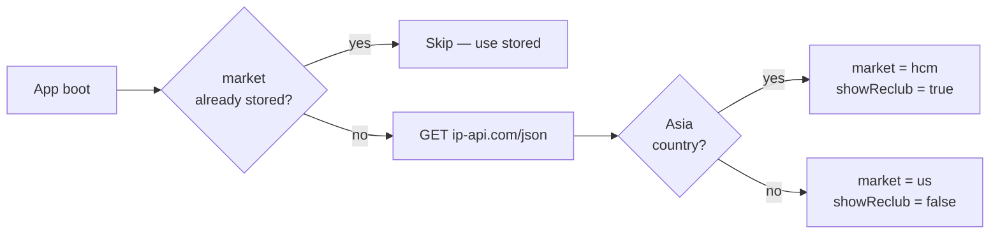
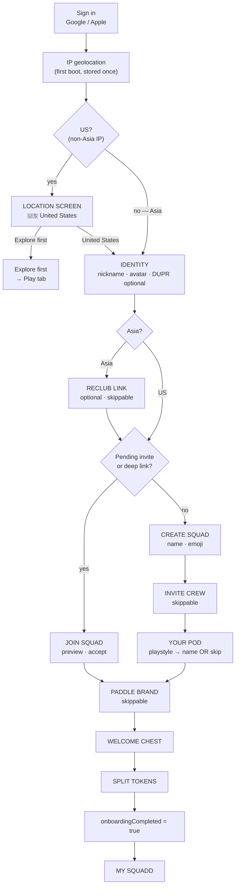
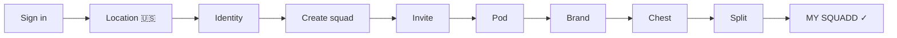
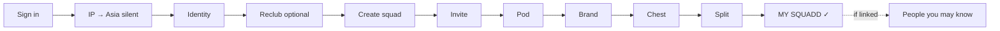
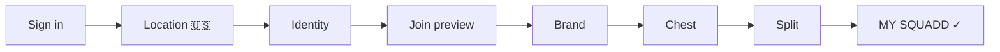
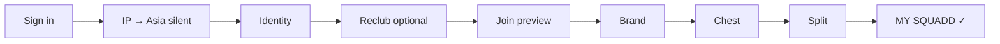
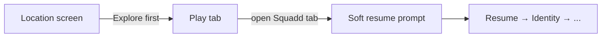

# Unified Onboarding Flow — Spec v2

> **Status:** Design locked — awaiting implementation approval.  
> **Last updated:** 2026-06-20  
> **Goal:** One signup funnel from sign-in → **MY SQUADD**. Squadd US-first; Reclub Asia-gated.  
> **No code changes yet.**

---

## Decisions locked

| # | Question | Decision |
|---|----------|----------|
| 1 | US market v1 | **Country only** — no city picker. Store `market = us`. |
| 2 | Asia location | **No picker screen** — detect country/region/city once via `ip-api.com` on first launch, default `hcmc` if detection fails or is Asia. No manual picker yet. |
| 3 | People you may know | **Undecided** — leave outside funnel for now; revisit post-launch. |
| 4 | Explore without squad | **Allowed** — "Explore app first" skip button visible on Location screen. User lands on Play tab. Funnel resumes from last step next time they open Squadd. |
| 5 | Completion flag | **One flag only** — `onboardingCompleted = true` only when user **creates or joins a squad for the first time**. Before that point, it is `false` regardless of identity/Reclub completion. |

---

## 1. Design rules

| Rule | Detail |
|------|--------|
| **One funnel** | After first sign-in, user stays in onboarding until MY SQUADD or taps "Explore first". |
| **Nickname once** | Single identity step; `SquadNicknameScreen` removed from create path. |
| **IP geolocation** | `ip-api.com` called once on first launch → stores `country`, `region`, `city`. Determines `market` and whether Reclub shows. No repeated calls. |
| **Location screen** | **US only** — one tap `[ United States ]`. Asia detected silently; no screen unless needed later. |
| **No auto-pod during funnel** | `GET /api/squads/my` must not call `ensurePlayerHasPod()` while `onboardingCompleted = false`. Fixes CREATE POD 409. |
| **Reclub** | Asia only, skippable. US: never shown in funnel. Always accessible from Profile. |
| **Carousel** | Returning users only (no squad, `onboardingCompleted = true`). Never on first signup. |
| **Persist step** | AsyncStorage + server flag. Kill/reopen → resume at last step, not home. |
| **Explore escape hatch** | Visible on Location screen. Skips funnel → Play tab. Funnel re-enters on next Squadd open. |
| **`onboardingCompleted`** | Single flag. `true` only after first squad create or join is confirmed. |

---

## 2. IP geolocation (replaces location picker for Asia)

- **API:** `http://ip-api.com/json/` — free tier, no key required, called once
- **Called:** On first app launch (before sign-in), or first time auth hydrates with no stored market
- **Stored:** `country`, `region`, `city` in `authStore` (persisted via SecureStore)
- **Never repeated:** Once stored, value is reused. Can be reset only by sign-out.
- **Asia detection logic:**

```
if country in [VN, PH, MY, SG, TH, ID, KH] → market = 'hcm', showReclub = true
else → market = 'us', showReclub = false
```

- **Fallback if API fails or unavailable:** `market = 'us'`, `showReclub = false` (safe default for US launch)



---

## 3. Location screen (US-only, one tap)

Shown only to users whose IP resolves to **non-Asia** (or detection failed).

```
┌──────────────────────────────┐
│  Where do you play?          │
│                              │
│  [ 🇺🇸  United States  →  ]  │
│                              │
│  Explore app first ↗         │  ← escape hatch
└──────────────────────────────┘
```

**Asia users:** Location screen is **skipped entirely** — market set silently by IP. They go directly to Identity.

**US users:** One tap → market locked as `us` → Identity.

**Explore first:** Tap escape → Play tab. `onboardingCompleted` stays `false`. Next Squadd open → resume at Location or Identity.

---

## 4. Master flow — all signups



---

## 5. Flow A — US, create squad

**Persona:** US player, no invite.

```
Sign in
  → IP geolocation (silent, first time only)
  → LOCATION SCREEN   [ 🇺🇸 United States ]
  → IDENTITY          nickname · avatar · DUPR optional
  → CREATE SQUAD      name · emoji
  → INVITE CREW       skip ok
  → YOUR POD          playstyle → name OR skip
  → PADDLE BRAND      skip ok
  → WELCOME CHEST     one-time open
  → SPLIT TOKENS      donate slider · confirm
  → onboardingCompleted = true
  → MY SQUADD
```

**Total:** 8 screens (sign-in + 7)  
**Removed vs today:** second nickname screen, carousel, Reclub, People you may know before MY SQUADD



---

## 6. Flow B — Asia, create squad

**Persona:** Asia player (detected by IP), may link Reclub.

```
Sign in
  → IP geolocation (silent) → Asia detected → no location screen
  → IDENTITY          nickname · avatar · DUPR optional
  → RECLUB LINK       search & link OR Skip
  → CREATE SQUAD
  → INVITE CREW       skip ok
  → YOUR POD          skip ok
  → PADDLE BRAND      skip ok
  → WELCOME CHEST
  → SPLIT TOKENS
  → onboardingCompleted = true
  → MY SQUADD
  → (after, non-blocking) PEOPLE YOU MAY KNOW — only if Reclub was linked
```

**Total:** 8 core screens + 1 optional post-funnel  
**No location screen** (IP handles it silently)



---

## 7. Flow C — US, join squad

**Persona:** US player with invite link or code.

```
Sign in
  → IP geolocation (silent)
  → LOCATION SCREEN   [ 🇺🇸 United States ]
  → IDENTITY
  → JOIN SQUAD PREVIEW  accept or back
  → PADDLE BRAND      skip ok
  → WELCOME CHEST     only if welcomeChestClaimed = false
  → SPLIT TOKENS
  → onboardingCompleted = true
  → MY SQUADD
```

**No Pod screens** — auto-pod created silently after token split (post `onboardingCompleted`).  
**Back hidden** on Brand when joining (no return path to create).



---

## 8. Flow D — Asia, join squad

```
Sign in
  → IP → Asia (silent)
  → IDENTITY
  → RECLUB LINK       skip ok
  → JOIN SQUAD PREVIEW
  → PADDLE BRAND
  → WELCOME CHEST
  → SPLIT TOKENS
  → onboardingCompleted = true
  → MY SQUADD
```



---

## 9. Flow E — "Explore first" escape

**User taps "Explore app first" on Location screen (US) or equivalent.**

```
Sign in
  → IP (silent)
  → LOCATION SCREEN
  → [ Explore app first ]
  → Play tab (funnel paused)

Next time user opens Squadd tab:
  → Resume funnel at IDENTITY (or Location if market not set yet)
```

**`onboardingCompleted` stays `false`.**  
**Squadd tab:** Does not show MY SQUADD or carousel — shows a **soft prompt**: *"Set up your squad to unlock the full experience"* → tap → resume funnel.



---

## 10. Flow F — Returning user (onboardingCompleted = true)

| Case | Route |
|------|-------|
| Has squad | Squadd tab → **MY SQUADD** |
| No squad (left / disbanded) | Squadd tab → **carousel** → ready (create/browse) |
| Joins new squad (`welcomeChestClaimed = false`) | Brand → chest → split → home |
| Joins new squad (`welcomeChestClaimed = true`) | → home (pod auto-created silently) |

---

## 11. Deep link handling across all flows

| Arrival state | Behavior |
|---------------|----------|
| Not signed in + invite link | Sign in → Location → Identity → [Asia: Reclub] → Join preview |
| Signed in, `onboardingCompleted = false` | Resume funnel → inject Join preview before Create |
| Signed in, `onboardingCompleted = true` | Squadd tab → invite-receive screen (existing behavior) |

**Pending invite storage:** `AsyncStorage.PENDING_INVITE_KEY` survives sign-in. Checked immediately after Identity (or Reclub for Asia) step.

---

## 12. Screen catalog (v2 — locked decisions)

| # | Screen ID | UI title | US | Asia | Required | Notes |
|---|-----------|----------|----|------|----------|-------|
| 0 | `signin` | Sign in | ✓ | ✓ | Yes | Google / Apple modal |
| 1 | `location` | Where do you play? | **US only** | **Skipped** | US only | One tap: United States. Explore escape link. |
| 2 | `identity` | Your Squadd identity | ✓ | ✓ | Yes | Nickname (required) · avatar · DUPR optional |
| 3 | `reclub` | Link Reclub | **Skipped** | ✓ | No | Asia only; skippable |
| 4a | `join-preview` | Squad invite | ✓ | ✓ | If invite | From deep link / pending |
| 4b | `create-squad` | Create your squad | ✓ | ✓ | If no invite | Name · emoji |
| 5 | `invite-crew` | Invite your crew | ✓ | ✓ | No | Create path; skip ok |
| 6 | `pod` | Your Pod | ✓ | ✓ | No | Create path only; skip → auto pod |
| 7 | `brand` | Paddle brand | ✓ | ✓ | No | Skip ok; join: back hidden |
| 8 | `welcome-chest` | Welcome chest | ✓ | ✓ | Yes* | *Once per profile |
| 9 | `token-split` | Split club tokens | ✓ | ✓ | Yes* | *If tokens awarded |
| 10 | `home` | MY SQUADD | ✓ | ✓ | — | `onboardingCompleted = true` written here |
| 11 | `people` | People you may know | Skip | If linked | No | Post-funnel only; non-blocking |

---

## 13. `onboardingCompleted` — single flag, redefined

| Was | Now |
|-----|-----|
| `true` = profile identity saved (after step 4 `POST /api/profile`) | `true` = **squad created or joined for the first time** (first write at MY SQUADD step) |
| Two flags considered (`onboardingCompleted` + `squadOnboardingCompleted`) | **One flag only** |

### Write conditions

| Event | Write |
|-------|-------|
| First squad created (`POST /api/squads` succeeds) | `POST /api/profile` with `onboardingCompleted: true` **after** token split |
| First squad joined (join-by-code or accept-invite) | Same — written after token split (or at MY SQUADD if chest already claimed) |
| Identity/Reclub done but no squad yet | **Not written** — user chose "Explore first" or quit |

### Read / resume conditions

| `onboardingCompleted` | Auth | Squadd tab behavior |
|----------------------|------|---------------------|
| `false` | Signed in | Soft prompt → resume funnel |
| `false` | Not signed in | Sign-in gate |
| `true` | Signed in | Normal: MY SQUADD or carousel |

### Backend

- `POST /api/squads/my` must check: if `onboardingCompleted = false` → **skip `ensurePlayerHasPod()`**
- `POST /api/pods` during funnel works normally
- After `onboardingCompleted = true` → self-heal resumes as before

---

## 14. Identity step — merged sub-steps

Single screen group (replaces profile steps 0–4 and `SquadNicknameScreen`):

| Sub-step | Content | Required | API |
|----------|---------|----------|-----|
| 2a | Squadd nickname `@handle` | Yes | `GET/POST /api/squads/nickname` |
| 2b | Avatar / gender | Yes | Stored locally until final profile save |
| 2c | DUPR | No, skip button | Stored locally until final profile save |

All three saved together at end of sub-step 2c via `POST /api/profile`.  
**No duplicate nickname call on create path.**

---

## 15. What is removed vs today

| What | Where it lives today | Decision |
|------|---------------------|----------|
| `SquadNicknameScreen` | Squad create path | **Remove** — nickname captured in Identity step |
| Profile steps 0–4 (`OnboardingScreen`) | `App.tsx` flow | **Replace** with unified Identity step |
| Reclub for US users | Profile step 4 | **Move to Profile sheet only** |
| Marketing carousel on signup | First Squadd open | **Remove from signup path** |
| `fetchMySquad()` before Pod step | `SquadCreatedScreen → Go to my squad` | **Defer** until after Pod step |
| Auto-pod in `GET /api/squads/my` during onboarding | Backend | **Guard with `onboardingCompleted` flag** |
| People you may know before MY SQUADD | After profile complete | **Move to post-funnel (non-blocking)** |
| `flowScreen = 'main'` default on cold start | `App.tsx` | **Check `onboardingCompleted` on cold start → resume funnel** |

---

## 16. Comparison: today vs v2

| | Today | v2 |
|---|--------|-----|
| Funnels | 2 disconnected | **1 unified** |
| Nickname screens | 2 | **1** |
| Location / market | Hardcoded HCMC | **IP geolocation (once) + US screen** |
| Reclub | All users, step 4 | **Asia only, post-Identity** |
| After profile complete | Play / Circle (disconnected) | **Continue funnel → squad** |
| CREATE POD 409 | Common | **Prevented (no auto-pod during funnel)** |
| Carousel on signup | Yes | **No** |
| `onboardingCompleted` meaning | Profile saved | **Squad created or joined** |
| Explore without squad | Not allowed | **Allowed (escape hatch)** |
| Cold start, incomplete funnel | Stays on Play | **Resumes funnel** |
| Total screens to MY SQUADD | ~17 | **8–9** |

---

## 17. Open items (not blocking build)

| Item | Notes |
|------|-------|
| People you may know placement | Undecided — left for post-launch |
| Asia city sub-picker | Not in v1; HCMC default for all Asia |
| US city picker | Not in v1; `market = us` is sufficient |
| Squadd tab soft-resume UI | Copy and design TBD ("Set up your squad…") |
| `ip-api.com` rate limit | Free tier: 45 req/min per IP. Called once at boot — well within limits. Use `http://` not `https://` on free tier. |

---

## 18. Related docs

- Current state audit: [`ONBOARDING_SQUAD_POD_FLOWS.md`](./ONBOARDING_SQUAD_POD_FLOWS.md)
- Spec v1: superseded by this document
- Shipped phase 1.1 plan: `.cursor/plans/onboarding_flow_merge_91828f8e.plan.md`
