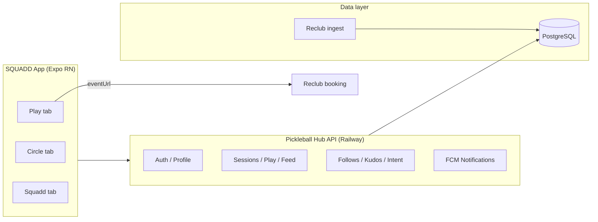

# SQUADD Mobile — Product Overview

**Last updated:** June 2025  
**App name:** SQUADD (internal slug: `the-hub`)  
**Bundle ID:** `com.squadd.thehub.app`  
**Primary market:** Ho Chi Minh City pickleball players  
**Backend:** Shared with [HCM Pickleball Hub](../README.md) (Next.js API on Railway)

---

## Executive summary

SQUADD is a **social-first pickleball companion app** for players in Ho Chi Minh City. It sits on top of **Reclub** session data (scraped and refreshed by the Pickleball Hub pipeline) and adds what Reclub does not emphasize: **who you know is playing**, **curated session picks for your level**, and a **circle feed** for following friends, kudos, and live court presence.

The product thesis: **finding a good game is as much a social problem as a scheduling problem.** Players want sessions that match their DUPR, show friends on the roster, and surface “I want to play this afternoon” signals—not only a flat list of events.

---

## Why SQUADD exists

| Problem | How SQUADD addresses it |
|--------|-------------------------|
| Reclub lists many sessions; hard to compare value, level fit, and social context | **Top 5** ranked sessions per day with **match score** (DUPR + fill + returning players) |
| No native “friends playing tonight” view | **Friends** tab: friends going today/tomorrow, saved sessions, **play intents** |
| Pickleball community is hyper-local and chat-driven (Zalo) | **Play intent** with optional Zalo number; feed and presence around venues |
| Player identity is fragmented across apps | **Link Reclub profile** at onboarding; gear avatar; follow graph and kudos |
| Future: squads / teams / light competition | **Squadd** tab: regional waitlist and gamified onboarding (pre-launch) |

**Strategic fit with Pickleball Hub:** The web hub targets **analytics** (organizers, venues, smart finder with maps and cost/hour). The mobile app targets **daily player habit** (open app → see top games → see friends → book on Reclub). See [product_roadmap.md](../../product_roadmap.md) for the broader platform vision.

---

## Who it is for

1. **Active HCMC players** who book via Reclub and care about level (DUPR) and who else is on the court.  
2. **Social players** who follow friends, give kudos after sessions, and use the feed to decide where to go.  
3. **Early adopters** signing up for the future **Squadd** squad/leaderboard experience (waitlist).

**Not in scope today:** club managers, venue owners, or deep market analytics (those live on the web dashboards).

---

## Product architecture (high level)

- **Session truth** comes from scraped Reclub data (rosters, fees, venues, DUPR stats).  
- **Social graph** is SQUADD-native (follows, kudos, intents) keyed to linked Reclub player IDs.  
- **Booking** always leaves the app via Reclub `eventUrl` (no in-app checkout).

---

## Navigation and information architecture

Bottom tabs (left → right):

| Tab | Label | Role |
|-----|-------|------|
| **Circle** | Circle | Social feed, presence, player search, follows |
| **Squadd** | Squadd | Waitlist / future squads (marketing carousel) |
| **Play** | Play | Session discovery (“Where to play?”) |

Additional **flows** (full-screen overlays, not tabs):

- Profile sheet (settings, Reclub link, gear, notifications, account delete)  
- Onboarding (4 steps) → optional **People you may know**  
- Gear setup sheet  
- Push debug screen (dev/support)  
- **Explore sessions** (swipe deck) — implemented but **no in-app entry point** wired today (see gaps)

---

## Core features (shipped)

### 1. Authentication and identity

- **Sign in:** Google (production builds) and Apple (iOS); dev token for local testing.  
- **Secure session:** JWT in Expo Secure Store; `authedFetch` for all private APIs.  
- **Reclub linking:** Onboarding step searches Reclub players and links `reclubUserId` to the SQUADD profile (409 if already linked elsewhere).  
- **Profile fields:** Display name, avatar (Google/Apple), DUPR rating, gender, preferred time slots (morning / afternoon / evening).

### 2. Play tab — session discovery

**Sub-tabs:**

- **Top 5** — Server-curated best sessions for today or tomorrow (`GET /api/play`), grouped by time period (morning / afternoon / evening) with slot availability stats.  
- **Friends** — Requires sign-in:
  - Friends going today / tomorrow (`/api/feed/friends-going`)  
  - Saved sessions (shortlist persisted locally + pruned when sessions start)  
  - **Play intents** from people you follow (`/api/play-intent/feed`)  
  - **Intent sheet** — Post “I want to play” with time slot, day (today / tomorrow / weekend), optional Zalo  

**Filters** (Top 5; signed-in for filter sheet):

- Minimum DUPR (default 2.9)  
- Time-of-day multi-select  
- Today vs tomorrow  
- Location: GPS when granted; defaults to HCMC center (~10.78, 106.69)  
- Vibe filters (social / competitive) and “spots only” exist in API/UI for Top 5 in some paths  

**Session cards show:**

- Club, venue, time, price/duration, distance  
- Fill rate, “filling fast”, match score ring  
- Vibe tag (social / competitive / chill)  
- Roster avatars, “regulars”, friends joining (with overflow count)  
- Tap through to **Reclub** booking URL  

**Match score** (0–100, server-side `calculateMatchScore`):

- ~55% DUPR fit vs session average  
- ~30% fill momentum  
- ~15% returning-player percentage (community signal)

**Location:** Permission prompt after second visit to Play tab (signed-in); used for distance and geo-filtered play API.

### 3. Circle tab — social layer

**Feed** (`GET /api/feed`, paginated):

- Event types: friend joining a session, played (today / historical), you are playing, DUPR updates, new follower, streak milestones, etc.  
- **Kudos** on feed items: fistbump, flame, star (`POST /api/kudos`)  
- Tap session items → roster modal with overlap-based player recommendations (`/api/sessions/overlap`)  
- Tips for avatar tap and kudos (first-time UX)

**Presence** (`GET /api/feed/presence`):

- Live venues (players on court now)  
- Upcoming sessions at venues  

**Players sub-tab:**

- Following list, unfollow  
- Player search (`/api/players/search`)  
- **People you may know** — co-players from shared sessions (`/api/players/{id}/co-players`)  
- Player profile sheet: follow, kudos summary, block, report  

**Activity** (overlay): merged kudos + followers last 7 days (`/api/activity`)

**Gear teaser:** Prompts incomplete gear profile setup (cap, shirt, paddle, shoes — cosmetic identity).

### 4. Squadd tab — pre-launch waitlist

- Full-screen **carousel onboarding** (Bangers font, squad emoji, regional cities: Vietnam, Philippines, Malaysia).  
- **Reserve squad name** → `POST /api/squad-waitlist`  
- Local persistence of registration; leaderboard mock UI (not live product).  
- Perks marketed: Founder Badge, Early Access, First Squad Name Selection.

This tab is **vision / lead gen**, not operational squads yet.

### 5. Gear profile

- Optional player “loadout”: gender presentation, cap, shirt, paddle, shoes (brand bubbles).  
- Synced to `/api/players/{profileId}/gear`; cached on device.  
- Shown in Circle teaser and profile flows.

### 6. Push notifications (FCM)

- Registration via `/api/players/push-token`  
- User toggle in profile (wired to notification handler + foreground display)  
- **Cron-driven:** session-finished kudos prompts (PN6), “you are playing” reminders (PN7)  
- Test endpoint from profile (dev-friendly)  
- Hidden **Push Debug** screen for token, permission, and delivery logs  

Copy in `app.json`: kudos, friends playing, new followers.

### 7. Analytics and observability

- **PostHog** (autocapture + session replay on profile-masked areas)  
- **UXCam** dependency present  
- Verbose `debugLog` trails for perf (Top 5, friends load, etc.)

---

## User journeys

### New user (happy path)

1. Open app → splash → browse **Top 5** without account (limited).  
2. Sign up (Google / Apple) → **Onboarding:** DUPR, time preferences, gender, link Reclub player.  
3. **People you may know** → follow suggestions → land on **Circle**.  
4. Switch to **Play** → Top 5 for today → open Reclub to book.  
5. Follow more players → **Friends** tab shows who is going → post **play intent** optional.

### Returning user (daily)

1. **Circle** — scan feed + presence; give kudos.  
2. **Play** — Top 5 or Friends → book or save session.  
3. Receive push when friend finishes a session or when you have an upcoming roster spot.

### Squadd waitlist

1. **Squadd** tab → carousel → pick country/city/squad name → join waitlist.

---

## Technical snapshot (for handoff)

| Layer | Stack |
|-------|--------|
| Mobile | Expo 52, React Native 0.76, TypeScript, Zustand |
| Auth | Google Sign-In, Apple Authentication, JWT |
| Push | `@react-native-firebase/messaging` + Expo Notifications |
| API base (prod) | `https://pickleball-hub-mobile-i9ag-production.up.railway.app` |
| iOS / Android | Native projects under `pickleball-hub/mobile/ios` & `android` |
| Builds | EAS (`eas.json`): preview + production APK profiles |

Key mobile paths: `pickleball-hub/mobile/App.tsx`, `src/screens/*`, `src/stores/*`.

---

## Relationship to Pickleball Hub (web)

| Capability | Web hub | SQUADD mobile |
|------------|---------|---------------|
| Session list / filters | Full finder + map | Top 5 + Friends (no map) |
| Cost per hour, perks filters | Yes | No |
| Club / organizer / venue dashboards | Yes | No |
| Social feed / follows / kudos | No | Yes |
| Play intent + Zalo | No | Yes |
| Squads / waitlist | No | Yes (waitlist only) |
| Reclub deep link | Yes | Yes |

Mobile is **not a port of the web app**; it is the **social and habit layer** on the same database and ingest pipeline.

---

## Product gaps and opportunities

Prioritized from codebase vs [product_roadmap.md](../../product_roadmap.md) and UX completeness.

### Critical / UX debt

1. **Explore swipe deck unreachable** — `ExploreSessionsScreen` and full `swipe-deck` API are built, but `onOpenExplore` is never called from Play UI. Users only see Top 5, not the Tinder-style deck.  
2. **Dead code: `ShortlistScreen`** — Functionality merged into Play → Friends; screen file unused.  
3. **Guest vs signed-in split** — Top 5 works anonymously; social features gated with sign-up prompts; no single clear “what you unlock” explainer.

### Discovery vs roadmap

4. **No map view** on mobile (web has Leaflet map).  
5. **No cost-per-hour or “best value”** sorting (roadmap player feature).  
6. **No “likelihood to play” / waitlist warning** (overbooked session UX).  
7. **No price, perk, or session-type filters** on mobile (web has these).  
8. **No level-based push alerts** (“your level + district”) — roadmap premium.  
9. **No historical trends** (“Wednesday 7pm fills 3h early”).

### Booking and monetization

10. **No in-app booking** — always external Reclub; no affiliate tracking visible in app.  
11. **No subscription / premium** — roadmap freemium not implemented.  
12. **No promoted session placement** for clubs.

### Squadd vision

13. **Squadd tab is waitlist only** — no squads, XP, challenges, or chat despite UI teasing leaderboards.  
14. **Multi-country waitlist** (PH, MY) vs **data and Play API tuned for HCMC** — positioning mismatch until data expands.

### Social depth

15. **No in-app messaging** — relies on Zalo in play intent.  
16. **No session reviews / club ratings** (roadmap UGC).  
17. **Block/report exist** but no user-facing moderation story in-app.

### Platform and quality

18. **English-first UI**; Vietnam timezone logic in code but no Vietnamese copy.  
19. **Offline / poor network** — little caching beyond gear and saved session IDs.  
20. **i18n and accessibility** — limited audit (screen reader labels partially present on tabs).  
21. **Organizer/venue personas** — zero mobile surface; all B2B remains web-only.

### Suggested next bets (product)

| Bet | Rationale |
|-----|-----------|
| Wire **Explore** or merge deck into Top 5 “See all” | Unlocks existing swipe investment |
| **Map + distance** on Play | Matches mental model of “near me” |
| **Waitlist / fill warnings** on cards | High player pain in HCMC |
| **Filter alerts push** | Clear premium hook from roadmap |
| **Ship Squadd MVP** or rename tab | Reduces confusion between waitlist and brand |
| **VN localization** | Market fit for HCMC focus |

---

## Metrics to track (recommended)

If not already in PostHog dashboards, align product reviews on:

- D1/D7 retention after onboarding complete  
- % profiles with `reclubUserId` linked  
- Top 5 card tap → Reclub outbound click-through  
- Follows per user, kudos sent per WAU  
- Play intents created / day  
- Push opt-in rate and PN6/PN7 delivery success  
- Squadd waitlist signups by city  

---

## Appendix: main API surface (mobile)

| Area | Endpoints |
|------|-----------|
| Auth | `POST /api/auth/mobile-token` |
| Profile | `POST /api/profile`, `POST /api/players/profile` |
| Play | `GET /api/play`, `GET /api/sessions/swipe-deck` |
| Social | `GET/POST /api/feed`, `GET /api/feed/friends-going`, `GET /api/feed/presence` |
| Follows | `GET/POST/DELETE /api/follows`, `GET /api/follows/followers` |
| Players | `GET /api/players/search`, `GET /api/players/{id}/profile`, `GET /api/players/{id}/co-players` |
| Sessions | `GET /api/sessions/{id}/roster`, `GET /api/sessions/overlap` |
| Intent | `POST/DELETE /api/play-intent`, `GET /api/play-intent/feed` |
| Kudos | `POST /api/kudos`, `GET /api/kudos/givers` |
| Gear | `GET/PUT /api/players/{profileId}/gear` |
| Push | `POST /api/players/push-token`, `POST /api/notifications/test` |
| Waitlist | `POST /api/squad-waitlist` |

---

## Document maintenance

Update this file when:

- Play/Circle/Squadd IA changes  
- Booking integration or monetization ships  
- New cities or data sources go live  
- Squadd moves from waitlist to live squads  

**Source of truth:** `pickleball-hub/mobile/` and `pickleball-hub/src/app/api/`.
